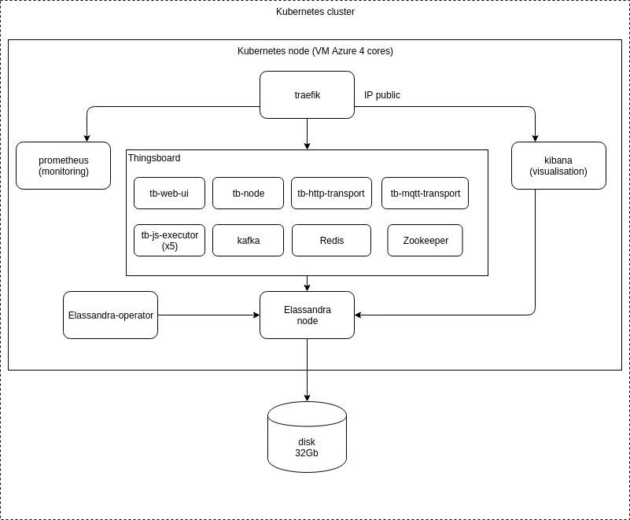

# Orchid

Repository for the Orchid project

## Web UI

The Thingsboard Web UI is accessible from https://tb-web-ui.941a7aa2-kube2-azure-northeurope.azure.strapcloud.com/login
The administration account is *sysadmin@thingsboard.org*.

## Kibana

The Kibana Web UI is accessible from https://kibana-cl1-dc1.941a7aa2-kube2-azure-northeurope.azure.strapcloud.com/

## MQTT

Here is the MQTT contact point 
* **IP** : 52.169.159.181
* **PORT** : 1883

## Kubernetes
source kube-orchid.env 
make init 

## Install

Use https://github.com/strapdata/k8s-thingsboard

## Deploy prometheus

Update strapdata HELM repo:

helm repo remove strapdata && az acr helm repo add -n strapdata

Deploy:

. kube-orchid.env
deploy_prometheus_operator

## Usage

https://traefik.orchid.test.strapkube.com/dashboard/
https://tb-web-ui.orchid.test.strapkube.com/
https://kibana-orchid-dc1.orchid.azure.strapcloud.com/
https://grafana.orchid.azure.strapcloud.com/

